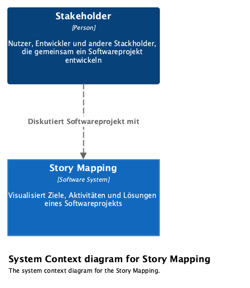
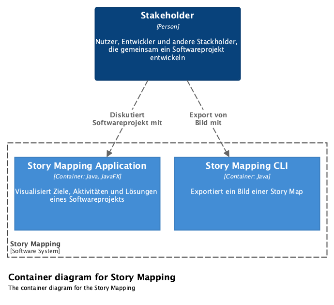
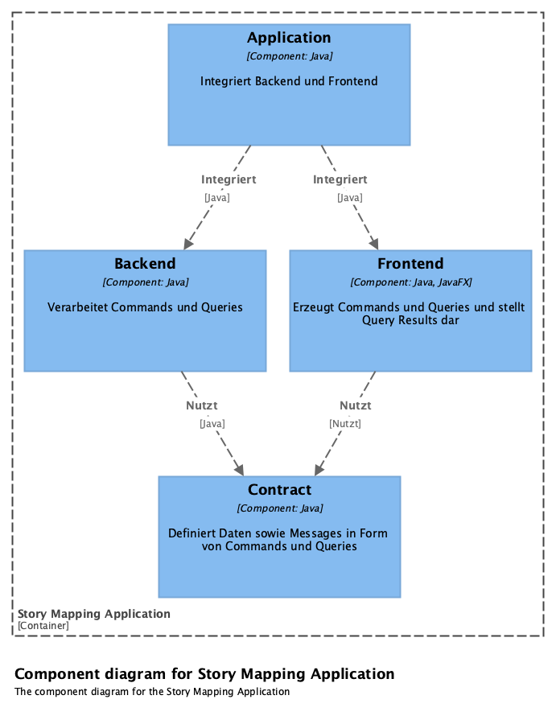

= Story Mapping
:toc:

== Architektur

=== System Context

.System Context Story Mapping

=== Containers of Story Mapping

.Container Story Mapping

=== Components of Story Mapping Application

.Component Story Mapping Application

